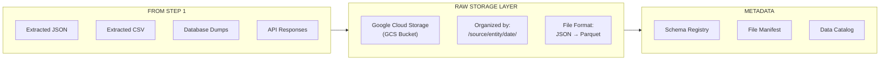
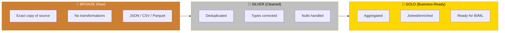
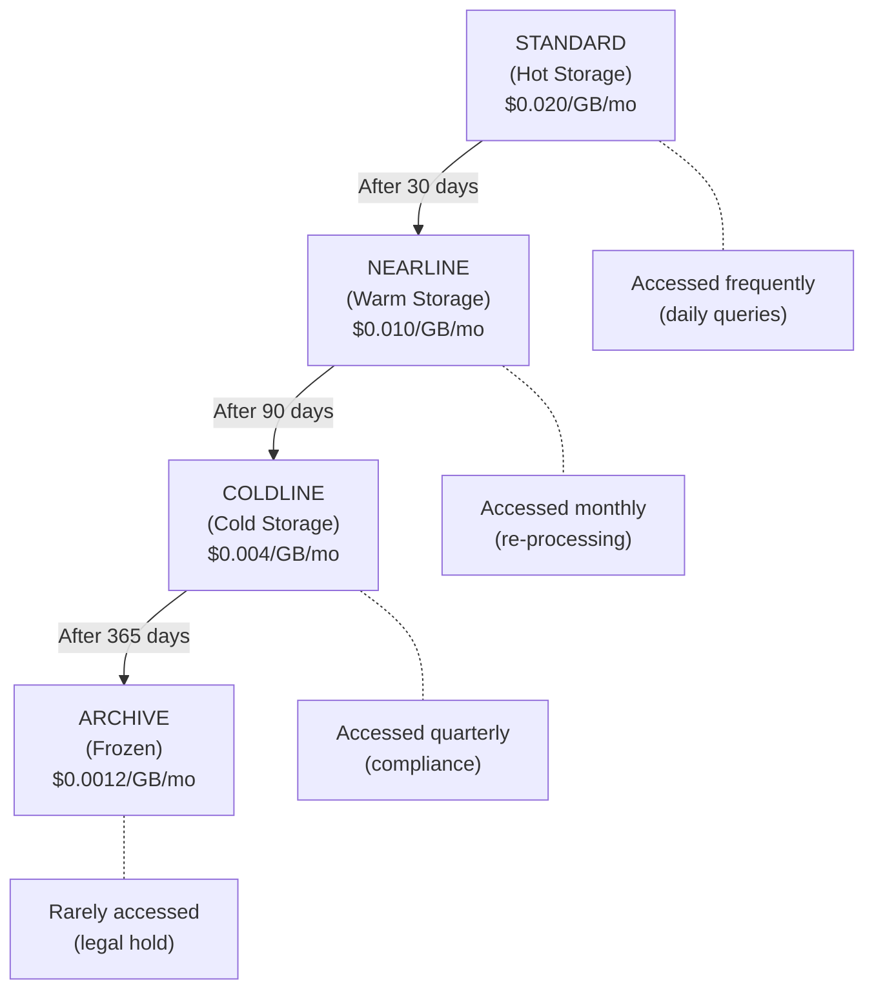

# Step 2: STORE RAW — Data Lake & Raw Storage

> [!NOTE]
> After collecting data from sources, you need a place to **land it in its raw, unmodified form**. This is your **Data Lake** — a centralized, scalable, cheap storage layer that holds data in any format before it's cleaned and transformed.

---

## What Happens in This Step?



**The Goal**: Store raw data cheaply, durably, and in an organized way so the Transform step can easily find and process it.

---

## Key Terminologies

| Term | Definition |
|------|-----------|
| **Data Lake** | A centralized repository that stores all types of data (structured, semi-structured, unstructured) at any scale in its raw form |
| **Landing Zone** | The first place data arrives in your lake — completely raw, untouched |
| **Blob Storage** | Binary Large Object storage — stores files as binary blobs (GCS, S3, ADLS) |
| **Object Storage** | Same as blob storage — stores data as objects with metadata, not in a file system hierarchy |
| **Bucket** | The top-level container in cloud object storage (like a root folder) |
| **Prefix** | The "folder path" in object storage (buckets don't have real folders, just key prefixes) |
| **Partition** | Organizing data into subdirectories by a key (date, region, source) for faster queries |
| **File Format** | How data is serialized on disk — CSV, JSON, Parquet, Avro, ORC |
| **Columnar Format** | Stores data by column instead of by row (Parquet, ORC) — much faster for analytics |
| **Row Format** | Stores data row by row (CSV, JSON, Avro) — better for writing and streaming |
| **Compression** | Reducing file size (gzip, snappy, zstd) to save storage costs and speed up reads |
| **Schema-on-Read** | Don't enforce schema when writing to the lake. Apply schema when you read/query the data |
| **Schema-on-Write** | Enforce schema before writing (databases/warehouses use this) |
| **Immutability** | Raw data should never be modified after landing. Create new files instead of overwriting |
| **Retention Policy** | Rules for how long to keep data before deletion (e.g., keep raw data for 90 days) |
| **Lifecycle Rules** | Automated rules to move data between storage tiers (hot → warm → cold → archive) |
| **Storage Tiers** | Different cost/access levels: Standard (hot), Nearline (warm), Coldline (cold), Archive |
| **Data Swamp** | A data lake that became unusable due to poor organization, no metadata, no governance |
| **Medallion Architecture** | Organizing data into Bronze (raw), Silver (cleaned), Gold (business-ready) layers |
| **Hive Partitioning** | Partition format: `/year=2024/month=01/day=15/` — understood by most query engines |

---

## File Format Comparison — Critical Decision

Choosing the right file format is one of the most impactful decisions in data engineering:

| Format | Type | Human Readable | Compression | Schema | Speed (Analytics) | Best For |
|--------|------|:--------------:|:-----------:|:------:|:-----------------:|----------|
| **CSV** | Row | ✅ Yes | ❌ Poor | ❌ No | 🐌 Slow | Quick exports, spreadsheets |
| **JSON** | Row | ✅ Yes | ❌ Poor | ❌ No | 🐌 Slow | APIs, nested data, configs |
| **JSONL** | Row | ✅ Yes | ⚠️ OK | ❌ No | 🐌 Slow | Streaming, line-by-line processing |
| **Parquet** ⭐ | Columnar | ❌ No | ✅ Excellent | ✅ Yes | 🚀 Very Fast | Analytics, data lakes, warehouses |
| **Avro** | Row | ❌ No | ✅ Good | ✅ Yes | ⚡ Fast | Streaming, Kafka, schema evolution |
| **ORC** | Columnar | ❌ No | ✅ Excellent | ✅ Yes | 🚀 Very Fast | Hive/Hadoop ecosystem |
| **Delta Lake** | Columnar+ | ❌ No | ✅ Excellent | ✅ Yes | 🚀 Very Fast | ACID transactions on data lakes |

### Size Comparison (Same 1M Row Dataset)

```
CSV:      ~500 MB (uncompressed)
JSON:     ~800 MB (verbose with keys)
Parquet:  ~50 MB  (columnar + compression) ← 10-16x smaller!
Avro:     ~100 MB (row + compression)
ORC:      ~45 MB  (columnar + compression)
```

> [!TIP]
> **Use Parquet for your data lake.** It's the industry standard for analytical workloads. Store raw JSON/CSV in the landing zone, then convert to Parquet for long-term storage.

### Why Parquet Wins for Analytics

```
Query: SELECT AVG(price) FROM orders WHERE year = 2024

CSV/JSON: Must read ENTIRE file, all columns
          Reads: 500 MB

Parquet:  Reads ONLY the 'price' and 'year' columns
          Skips irrelevant row groups via metadata
          Reads: ~2 MB  (250x less I/O!)
```

---

## Setting Up Google Cloud Storage (GCS)

### Account Setup

```
1. Go to https://console.cloud.google.com
2. Create a new project (or use existing): "my-data-pipeline"
3. Enable the Cloud Storage API
4. Create a service account:
   - IAM & Admin → Service Accounts → Create
   - Name: "data-pipeline-sa"
   - Role: "Storage Admin" (for development; restrict in production)
   - Create Key → JSON → Download
   - Save as `service-account.json` in your project root
5. Install the gcloud CLI: https://cloud.google.com/sdk/docs/install
```

### Create Buckets with gcloud CLI

```bash
# Authenticate
gcloud auth activate-service-account --key-file=service-account.json
gcloud config set project my-data-pipeline

# Create the raw data bucket
# Naming: {company}-{env}-{purpose}
gcloud storage buckets create gs://mycompany-dev-raw-data \
    --location=US \
    --storage-class=STANDARD \
    --uniform-bucket-level-access

# Create the processed data bucket
gcloud storage buckets create gs://mycompany-dev-processed-data \
    --location=US \
    --storage-class=STANDARD

# Set lifecycle rule: move to Nearline after 30 days, delete after 365 days
cat > lifecycle.json << 'EOF'
{
  "rule": [
    {
      "action": {"type": "SetStorageClass", "storageClass": "NEARLINE"},
      "condition": {"age": 30}
    },
    {
      "action": {"type": "Delete"},
      "condition": {"age": 365}
    }
  ]
}
EOF

gcloud storage buckets update gs://mycompany-dev-raw-data \
    --lifecycle-file=lifecycle.json
```

### Python: Upload Raw Data to GCS

```python
"""
upload_to_gcs.py
----------------
Uploads raw extracted data to Google Cloud Storage.
Converts JSON/CSV to Parquet before uploading for efficiency.
"""

import os
import json
import pandas as pd
import pyarrow as pa
import pyarrow.parquet as pq
from google.cloud import storage
from datetime import datetime
from pathlib import Path


class GCSUploader:
    """Upload data to Google Cloud Storage with proper organization."""
    
    def __init__(self, bucket_name: str, credentials_path: str = None):
        """
        Args:
            bucket_name: GCS bucket name
            credentials_path: Path to service account JSON key
        """
        if credentials_path:
            os.environ["GOOGLE_APPLICATION_CREDENTIALS"] = credentials_path
        
        self.client = storage.Client()
        self.bucket = self.client.bucket(bucket_name)
    
    def upload_json_as_parquet(
        self,
        local_file: str,
        source_name: str,
        entity_name: str,
        partition_date: str = None
    ) -> str:
        """
        Read a local JSON file, convert to Parquet, upload to GCS.
        
        Directory structure in GCS (Hive-style partitioning):
            raw/{source}/{entity}/year=YYYY/month=MM/day=DD/data.parquet
        
        Args:
            local_file: Path to local JSON file
            source_name: Name of the data source (e.g., "postgres", "stripe")
            entity_name: Name of the entity (e.g., "users", "orders")
            partition_date: Date for partitioning (default: today)
        
        Returns:
            GCS URI of the uploaded file
        """
        # Read JSON
        with open(local_file) as f:
            data = json.load(f)
        
        records = data.get("data", data)  # Handle wrapped format
        if not records:
            print(f"No data in {local_file}, skipping")
            return None
        
        # Convert to DataFrame → Parquet
        df = pd.DataFrame(records)
        
        # Build GCS path with Hive partitioning
        if partition_date is None:
            partition_date = datetime.utcnow()
        elif isinstance(partition_date, str):
            partition_date = datetime.fromisoformat(partition_date)
        
        timestamp = datetime.utcnow().strftime("%H%M%S")
        
        gcs_path = (
            f"raw/{source_name}/{entity_name}/"
            f"year={partition_date.year}/"
            f"month={partition_date.month:02d}/"
            f"day={partition_date.day:02d}/"
            f"{entity_name}_{timestamp}.parquet"
        )
        
        # Convert to Parquet in memory
        table = pa.Table.from_pandas(df)
        
        # Write Parquet to a temp file
        temp_parquet = f"/tmp/{entity_name}_{timestamp}.parquet"
        pq.write_table(
            table, 
            temp_parquet,
            compression="snappy"  # Fast compression, good ratio
        )
        
        # Upload to GCS
        blob = self.bucket.blob(gcs_path)
        blob.upload_from_filename(temp_parquet)
        
        # Set metadata on the blob
        blob.metadata = {
            "source": source_name,
            "entity": entity_name,
            "record_count": str(len(df)),
            "columns": ",".join(df.columns.tolist()),
            "uploaded_at": datetime.utcnow().isoformat(),
            "original_file": os.path.basename(local_file)
        }
        blob.patch()
        
        # Cleanup temp file
        os.remove(temp_parquet)
        
        gcs_uri = f"gs://{self.bucket.name}/{gcs_path}"
        print(f"  Uploaded {len(df)} rows → {gcs_uri}")
        return gcs_uri
    
    def upload_raw_file(self, local_file: str, gcs_path: str) -> str:
        """Upload a file as-is to GCS (no conversion)."""
        blob = self.bucket.blob(gcs_path)
        blob.upload_from_filename(local_file)
        return f"gs://{self.bucket.name}/{gcs_path}"
    
    def list_files(self, prefix: str) -> list:
        """List all files under a GCS prefix."""
        blobs = self.client.list_blobs(self.bucket, prefix=prefix)
        return [blob.name for blob in blobs]


def upload_all_raw_files(
    raw_dir: str = "data/raw",
    bucket_name: str = "mycompany-dev-raw-data",
    credentials: str = "service-account.json"
):
    """Upload all files from the local raw directory to GCS."""
    
    uploader = GCSUploader(bucket_name, credentials)
    
    raw_files = list(Path(raw_dir).glob("*.json"))
    print(f"Found {len(raw_files)} files to upload\n")
    
    for file_path in raw_files:
        # Parse source and entity from filename: {source}_{entity}_{timestamp}.json
        parts = file_path.stem.rsplit("_", 1)  # Split off timestamp
        name_parts = parts[0].split("_", 1)
        
        if len(name_parts) >= 2:
            source_name = name_parts[0]
            entity_name = name_parts[1]
        else:
            source_name = "unknown"
            entity_name = name_parts[0]
        
        uploader.upload_json_as_parquet(
            local_file=str(file_path),
            source_name=source_name,
            entity_name=entity_name
        )
    
    print(f"\n✅ All files uploaded to gs://{bucket_name}/raw/")


# ===================== USAGE =====================

if __name__ == "__main__":
    upload_all_raw_files()
```

### Install Python Dependencies

```bash
pip install google-cloud-storage pyarrow pandas
```

Add to `requirements.txt`:
```txt
google-cloud-storage==2.14.0
pyarrow==14.0.1
pandas==2.1.4
```

---

## Alternative: BigQuery as a Raw Landing Zone

Instead of (or in addition to) GCS, you can load raw data directly into BigQuery:

```sql
-- Create a dataset for raw data
CREATE SCHEMA IF NOT EXISTS `my-project.raw_postgres`
OPTIONS (
    description = 'Raw data from PostgreSQL - untransformed',
    location = 'US',
    default_table_expiration_days = 90  -- Auto-delete after 90 days
);

-- Create an external table that reads directly from GCS Parquet files
CREATE OR REPLACE EXTERNAL TABLE `my-project.raw_postgres.orders`
OPTIONS (
    format = 'PARQUET',
    uris = ['gs://mycompany-dev-raw-data/raw/postgres/orders/year=*/month=*/day=*/*.parquet'],
    hive_partition_uri_prefix = 'gs://mycompany-dev-raw-data/raw/postgres/orders/',
    require_hive_partition_filter = true  -- Force users to specify partition (saves $$$)
);

-- Query raw data (BigQuery reads directly from GCS!)
SELECT *
FROM `my-project.raw_postgres.orders`
WHERE year = 2024 AND month = 1
LIMIT 100;
```

```python
"""
load_to_bigquery_raw.py
-----------------------
Load raw data directly into BigQuery as a landing zone.
"""

from google.cloud import bigquery
import pandas as pd
import json
import os


def load_json_to_bigquery(
    json_file: str,
    project_id: str,
    dataset_id: str,
    table_id: str
):
    """Load a JSON file into a BigQuery table."""
    
    client = bigquery.Client(project=project_id)
    table_ref = f"{project_id}.{dataset_id}.{table_id}"
    
    # Read JSON
    with open(json_file) as f:
        data = json.load(f)
    
    records = data.get("data", data)
    df = pd.DataFrame(records)
    
    # Add metadata columns
    df["_loaded_at"] = pd.Timestamp.utcnow()
    df["_source_file"] = os.path.basename(json_file)
    
    # Configure the load job
    job_config = bigquery.LoadJobConfig(
        write_disposition=bigquery.WriteDisposition.WRITE_APPEND,  # Append, don't overwrite
        schema_update_options=[
            bigquery.SchemaUpdateOption.ALLOW_FIELD_ADDITION  # Handle schema drift
        ],
        # Auto-detect schema from data
        autodetect=True,
    )
    
    # Load data
    job = client.load_table_from_dataframe(df, table_ref, job_config=job_config)
    job.result()  # Wait for completion
    
    print(f"Loaded {len(df)} rows → {table_ref}")


if __name__ == "__main__":
    load_json_to_bigquery(
        json_file="data/raw/postgres_orders_20240115T143025.json",
        project_id="my-data-pipeline",
        dataset_id="raw_postgres",
        table_id="orders"
    )
```

---

## Directory / Organization Strategy

### The Medallion Architecture (Bronze / Silver / Gold)



### GCS Directory Structure

```
gs://mycompany-dev-raw-data/
├── raw/                              # BRONZE layer
│   ├── postgres/
│   │   ├── users/
│   │   │   ├── year=2024/month=01/day=15/
│   │   │   │   └── users_143022.parquet
│   │   │   └── year=2024/month=01/day=16/
│   │   │       └── users_080015.parquet
│   │   └── orders/
│   │       └── year=2024/month=01/day=15/
│   │           └── orders_143025.parquet
│   ├── stripe/
│   │   ├── payments/
│   │   └── customers/
│   └── salesforce/
│       ├── leads/
│       └── opportunities/
│
├── staging/                          # SILVER layer (Step 3)
│   └── ...
│
└── curated/                          # GOLD layer (Step 3)
    └── ...
```

### BigQuery Dataset Structure

```
my-project/
├── raw_postgres          # Raw data from PostgreSQL
│   ├── users
│   ├── orders
│   └── products
├── raw_stripe            # Raw data from Stripe
│   ├── payments
│   └── customers
├── staging               # Cleaned/transformed (Step 3)
│   ├── stg_users
│   └── stg_orders
└── analytics             # Business-ready (Step 3)
    ├── dim_customers
    ├── dim_products
    └── fct_orders
```

---

## All Storage Alternatives Compared

### Cloud Object Storage (Data Lake)

| Service | Cloud | Free Tier | Price / GB / Month | Best For |
|---------|-------|-----------|-------------------|----------|
| **Google Cloud Storage** ⭐ | GCP | 5 GB | $0.020 (Standard) | BigQuery users, simplicity |
| **Amazon S3** | AWS | 5 GB | $0.023 (Standard) | AWS ecosystem, most popular |
| **Azure Data Lake Storage (ADLS)** | Azure | 5 GB | $0.018 (Hot) | Microsoft/Azure shops |
| **MinIO** | Self-hosted | Unlimited | Free (your hardware) | On-premise, S3-compatible |
| **Cloudflare R2** | Cloudflare | 10 GB | $0.015 (no egress!) | Cost savings on egress fees |
| **Backblaze B2** | Backblaze | 10 GB | $0.006 | Cheapest cloud storage |

### Why GCS Over the Others?

| Comparison | Verdict |
|-----------|---------|
| **GCS vs S3** | S3 is more popular and has more tooling. GCS is simpler and integrates natively with BigQuery. Choose based on your warehouse. |
| **GCS vs ADLS** | ADLS is better if you use Azure Synapse or Databricks on Azure. GCS for BigQuery. |
| **GCS vs MinIO** | MinIO is free but you manage the hardware. GCS is managed. Use MinIO for local dev/testing. |
| **GCS vs R2** | R2 has zero egress fees (GCS charges for downloads). Good for serving data publicly. |

> [!IMPORTANT]
> **Your storage choice should match your warehouse.** If you use BigQuery → GCS. If you use Redshift → S3. If you use Synapse → ADLS. The integration will be seamless.

### Lakehouse / Table Formats

These are **open table formats** that add database-like features (ACID transactions, time travel, schema evolution) on top of data lake files:

| Format | Created By | Key Feature | Best With |
|--------|-----------|-------------|-----------|
| **Delta Lake** | Databricks | ACID transactions, time travel | Databricks, Spark |
| **Apache Iceberg** | Netflix | Hidden partitioning, schema evolution | Snowflake, Trino, Spark |
| **Apache Hudi** | Uber | Efficient upserts, incremental processing | AWS, Spark |

```
When to use these?
- Starting out / learning → Skip these, use plain Parquet
- Production with millions of rows → Consider Iceberg or Delta
- Need to UPDATE/DELETE rows in your lake → Definitely use one of these
```

---

## Storage Tiers and Cost Optimization



> [!TIP]
> Set up **lifecycle rules** (shown in the gcloud CLI section above) to automatically move data between tiers. This can reduce storage costs by 80%+ for historical data.

---

## Common Mistakes to Avoid

> [!WARNING]
> 1. **Overwriting raw data** — Never modify or delete raw data. It's your safety net. Always create new files.
> 2. **No partitioning** — Without partitioning, every query scans ALL files. Partition by date at minimum.
> 3. **Using CSV for everything** — CSV is 10-16x larger than Parquet and much slower to query. Convert to Parquet.
> 4. **No metadata** — Tag your files with source, timestamp, row count. You'll thank yourself later.
> 5. **One giant file** — Split large datasets into files of ~100-500 MB each for parallel processing.
> 6. **No lifecycle rules** — Without them, storage costs grow forever. Set retention policies from day one.
> 7. **Mixing raw and transformed data** — Keep bronze/silver/gold in separate paths or datasets.

---

## Files Added After This Step

```
data-pipeline/
├── upload_to_gcs.py           # Upload raw data to GCS
├── load_to_bigquery_raw.py    # Alternative: load to BigQuery directly
├── service-account.json       # GCP credentials (⚠️ DO NOT commit to git!)
├── lifecycle.json             # GCS lifecycle rules
├── .gitignore                 # Add service-account.json here!
└── requirements.txt           # Updated with new dependencies
```

---

## Next Step

➡️ [Step 3: Transform — Data Modeling with dbt](file:///C:/Users/HP-3/.gemini/antigravity/brain/5ca411c8-c373-4619-a892-14ae28fee035/artifacts/03_transform_data_modeling.md)
